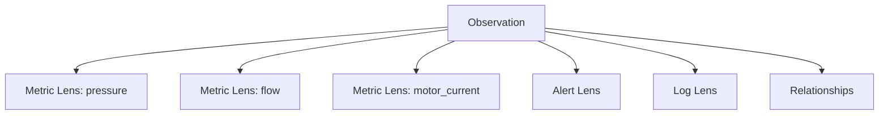

# Концепция за Observation и Lens

**Проект:** „Интелигентна мулти-агентна система за откриване на аномалии и супервизия на технологични процеси“  
**Статус:** Работна нормативна референция за MVP  
**Версия:** 6.1  
**Актуализирано:** 2026-08-31

## 1. Цел

Документът фиксира концептуалния модел на **Observation**, **Lens**, техните runtime инстанции и връзките между Lens-ове. Детайлният workflow и ролите на агентите са описани в `02_architecture_principles_and_runtime.md` и `04_pipeline_and_agent_concepts.md`.

## 2. Основна идея

Системата наблюдава процес или система чрез **Observation**. Observation обединява множество **Lens**-ове — отделни гледни точки към наблюдавания обект.



- **Observation**: „Какво цялостно наблюдаваме?“
- **Lens**: „Коя конкретна перспектива анализираме?“
- **Relationship**: „Какво съвместно поведение очакваме от няколко Lens-а?“

## 3. Definition vs Run

Конфигурацията и изпълнението са различни обекти:

```text
Observation Definition
        ↓ instantiate
ObservationRun
        ↓ creates
LensRun(s)
        ↓ produces
LensAnalysisResult(s)
```

`Lens` не е history record. Историята се формира от съхранените резултати на предходни `LensRun` изпълнения.

## 4. Observation

### 4.1. Отговорност

Observation съдържа най-малко:

- идентичност и цел на наблюдението;
- множество Lens конфигурации;
- общи настройки, които могат да бъдат override-нати от Lens;
- Relationships между Lens-ове;
- history policy;
- execution policy за Observation workflow-а.

### 4.2. Predefined и ad-hoc Observation

Инженерът може предварително да дефинира Observation. Системата може да поддържа и ad-hoc анализ, стартиран с естествен език.

Ad-hoc заявката **не създава отделен runtime модел**. Тя се преобразува до временна стандартна Observation/Lens конфигурация и влиза в същия workflow.

```text
Natural-language request
        ↓
resolve temporary Observation/Lenses
        ↓
standard Observation workflow
```

### 4.3. Execution policy

LensRuns са логически независими задачи. Те могат да се изпълняват конкурентно, като runtime трябва да позволява ограничаване на максималния брой едновременно изпълнявани LensRuns.

Примерна, но все още ненормативна конфигурационна форма:

```yaml
execution:
  max_parallel_lens_runs: 4
```

Фиксирано е **поведението** (конфигурируем concurrency limit), но точната schema позиция и default стойност остават implementation/configuration decision.

### 4.4. Observation Definition и type-specific Lens collections

За MVP `Observation Definition` остава aggregate owner на Lens конфигурациите. Съществуващото публично поле `lenses` се запазва без преименуване и продължава да означава Metric Lens definitions; Alert Lens-овете се добавят чрез отделна `alert_lenses` collection:

```text
Observation Definition
├── lenses:       0..N   # existing Metric Lens collection
├── alert_lenses: 0..N
└── relationships: 0..N
```

Това е type-specific model, но не въвежда alias `metric_lenses` и не променя съществуващия публичен Metric contract. Няма standalone Alert Lens lifecycle/API. `add-alert-lens-definition` разширява съществуващите Observation Definition create/read surfaces; не добавя нов public update или delete endpoint.

Ако/когато Observation Definition update capability бъде добавена, nested Lens collections следват snapshot/replacement semantics: подаденият collection описва желаното крайно състояние и aggregate промяната се валидира/persist-ва атомарно. Това е ownership invariant, а не изискване текущият Alert feature да въведе update endpoint.

Observation Definition трябва да съдържа поне един Lens общо. Следователно за MVP са валидни:

```text
Metric-only Observation
Alert-only Observation
Metric + Alert Observation
```

Невалидна е конфигурация без нито един Metric или Alert Lens. Липсващо `alert_lenses` при вход означава празен списък; canonical read projection запазва съществуващото `lenses` поле и винаги съдържа `alert_lenses`, включително `[]`.

`lens_id` uniqueness е type-local: Metric Lens IDs са уникални сред `lenses`, Alert Lens IDs са уникални сред `alert_lenses`, а еднакъв ID между различни Lens типове е допустим. Runtime identity остава type-aware.

Relationships са Metric-only за MVP. Configuration-time participant validation resolve-ва participant IDs само спрямо `lenses`; наличието на Alert Lens със същия ID не създава ambiguity и не го прави Relationship participant.

## 5. Lens

### 5.1. Атомарна перспектива

За MVP:

> **Един Metric Lens наблюдава една метрика.**

Това осигурява ясна отговорност, failure isolation, повторна употреба и естествена паралелизация. Cross-metric анализът е Observation-level concern.

### 5.2. Типове Lens

```text
MetricLens
AlertLens
LogLens
[future] EventLens
[future] domain-specific Lens
```

Всеки Lens type има специализиран pipeline, но всички pipelines реализират общ execution contract: приемат `LensRun` и връщат структуриран `LensAnalysisResult` със споделени lifecycle metadata и type-specific analytical payload.

### 5.3. Lens е повече от data address

Lens съдържа смисъл и аналитична цел за конкретния Observation. Една и съща метрика може да участва в различни Observations с различни Lens IDs и отделна история.

`analysis_objectives` е общ Lens-definition primitive за аналитичен intent, а не tool whitelist. За MVP се моделира като optional ordered duplicate-free list от non-whitespace opaque strings, без controlled vocabulary, priority, inheritance/default hierarchy или implicit tool selection. Конфигурираният ред и стойности се запазват.

Минималният type-aware идентификатор на Lens контекста е:

```text
observation_id + lens_type + lens_id
```

В type-specific анализ като Metric History `lens_type` е implicit чрез самия pipeline/result type, но cross-type конфигурацията не разчита на глобална `lens_id` uniqueness.

## 6. Metric Lens — semantic state

### 6.1. Задължително ядро

Всеки успешен Metric Lens определя поне:

- `trend`;
- `variability`.

Минималното numerical evidence ядро е:

```text
mean
std
min
max
slope
```

### 6.2. Controlled semantic vocabulary

Semantic descriptors използват предварително дефинирани стойности, а не свободен текст.

```yaml
trend:
  direction: increasing
  rate: moderate
```

MVP речник:

```text
trend.direction:
  increasing | decreasing | stable | unknown

trend.rate:
  slow | moderate | fast | not_classified | unknown

variability.state:
  low | moderate | high | not_classified | unknown
```

`oscillation` е отделна характеристика, а не `trend.direction`.

### 6.3. Optional analyses

Възможни optional характеристики са например:

```text
oscillation
change_point
spike
stuck_signal
drift
step_change
```

Точният tool registry не е фиксиран.

Семантика на optional property:

```text
полето липсва   → analysis not performed
state=absent    → performed, feature not detected
state=present   → performed, feature detected
state=unknown   → performed, inconclusive
```

## 7. Времеви перспективи на Metric Lens

Metric analysis използва три различни перспективи:

```text
current_state
→ как се държи сигналът в текущия window

reference_periods
→ как текущият window се различава от 0..N configured равни windows, изместени назад с конкретни offsets

history
→ как текущото ниво се развива спрямо предходни LensRun резултати
```

### 7.1. Reference periods

Metric Lens може да конфигурира `0..N` reference periods. Всеки reference window има същата продължителност като current analysis window, изместен е назад с configured offset и се сравнява независимо с current window.

Концептуален пример:

```yaml
reference_periods:
  - 1d
  - 7d
  - 14d
```

Reference periods дават periodic/seasonal temporal context, но не са baseline и не заменят `history`.

MVP сравнения:

```text
level
trend direction/rate
variability
```

### 7.2. History

History Analyzer използва persisted LensRun results, не raw telemetry.

Defaults:

```yaml
history_analysis:
  lookback_runs: 5
  level_change_tolerance: 0.05
```

Override priority:

```text
Lens > Observation > System default
```

Eligibility:

```text
usable:
  completed + good/degraded
  partial   + good/degraded

ignored:
  failed
  data_quality=insufficient
```

При 0 валидни предходни runs `history` липсва. При >=1 исторически анализ винаги се изпълнява върху:

```text
previous valid LensRuns + current LensRun
```

`history.direction` се базира на промяна на `mean` между runs, а не на вътрешния `current_state.trend.direction`.

Default transition tolerance = 5%. Near-zero reference може да даде `unknown` transition; unknown transitions не участват в denominator-а.

Direction:

```text
>=70% increasing → increasing
>=70% decreasing → decreasing
>=70% stable     → stable
otherwise        → mixed
no classifiable transitions → unknown
```

Pattern:

```text
sustained | reversing | oscillating | mixed | unknown
```

Priority:

```text
1. unknown       (<2 classifiable transitions)
2. oscillating   (>=2 последователни direction changes)
3. reversing     (една ясна смяна на противоположна доминираща посока)
4. sustained     (>=70% от transitions са един тип)
5. mixed         (иначе)
```

## 8. Alert Lens — accepted MVP model

### 8.1. Unified Alert Lens scope

Един `Alert Lens` модел поддържа както конкретен alert rule/type, така и bounded set от alert-и за component/asset/service/application. Разликата е в provider-native selector-а; не се въвеждат два отделни Lens типа.

```yaml
alert_lens:
  id: database_alerts
  type: alert
  name: "Database alerts"
  description: "Alert activity related to the database service"
  source: jira_track_and_release
  selector:
    query: "<provider-native query>"
  analysis_objectives:
    - "Assess recurrence and persistence"
  reference_periods:
    - 1d
    - 7d
```

MVP serialized definition използва explicit `type: alert`, required non-empty `name`, optional non-empty `description`, strict supported-provider identifier `source`, provider-native `selector.query`, optional `analysis_objectives` и optional `reference_periods`. Текущият supported Alert source е само `jira_track_and_release`.

`selector.query` е required non-whitespace opaque string. Definition layer-ът не го parse-ва, trim-ва, normalize-ва, rewrite-ва или допълва с time/status predicates; при persistence/read стойността се запазва точно както е конфигурирана. Selector-ът определя **кои alert-и** са релевантни; `LensRun` определя **кога** се наблюдават.

`reference_periods` е explicit ordered `0..N` collection, използва същия canonical offset primitive като Metric Lens, забранява duplicate offsets и няма implicit/system/Observation defaults за MVP. Unknown extra fields в Alert Lens-related input се толерират и игнорират; те не се persist-ват и не се връщат в canonical read projection.

### 8.2. Time membership

Current/reference alert е релевантен, ако lifecycle-ът му се пресича с window-а:

```text
started_at < window.end
AND
(ended_at is null OR ended_at > window.start)
```

MVP използва retrospective latest-known lifecycle information. Duration е full lifecycle duration; active records използват fixed `analysis_timestamp`.

### 8.3. Canonical status and importance

Normalized lifecycle status:

```text
active | resolved | unknown
```

Основно mapping-ът се определя от `ended_at`. Provider status се пази като source metadata.

Provider-specific priority/severity не се map-ва към общ severity vocabulary; optional `provider_importance` пази оригиналните provider semantics.

### 8.4. Analytical result

Alert Lens произвежда source-agnostic evidence:

```text
record_count
occurrence_count
status distribution
duration statistics
provider importance distribution [optional]
reference occurrence comparisons
Lens-local findings
overall_importance
```

Reference comparisons са по `occurrence_count`, могат да са много на брой по configured offsets и не включват historical raw records.

### 8.5. Agent boundary

`Alert Analysis Agent` работи само върху Alert Lens evidence. След mandatory deterministic evidence той може да използва bounded optional analytical tools върху вече извлечените и нормализирани current/reference данни. Той не използва metrics, logs, Relationships, RAG или external knowledge, не разширява Lens scope/time window и не прави system-level diagnosis.

### 8.6. Failure/result semantics

`completed|partial` Alert LensRun има usable `AlertAnalysisResult`. При `failed` Alert LensRun не се създава type-specific result artifact; downstream се използва unavailable Lens metadata от LensRun.

Подробният design е в `13_alert_lens_and_analysis_concept.md` и `14_alerts_analysis_pipeline_detailed.md`.

## 9. Log Lens — accepted MVP model

### 9.1. Scope и time semantics

`Log Lens` е bounded перспектива към определен набор от логове. Provider-native selector-ът определя **кои логове**, а `LensRun` определя **кога** се наблюдават.

За MVP current provider е Loki. Log record е point event и принадлежи към window-а, ако:

```text
window.start <= timestamp < window.end
```

Current и configured reference periods са independent equal-duration windows върху един и същ selector.

### 9.2. Acquisition и deterministic evidence

Logs pipeline не предполага materialization на целия log corpus. Той разделя:

```text
aggregate evidence
bounded textual log content
```

Mandatory current evidence включва най-малко:

```text
log count
logging rate
level distribution
error-level activity
```

Template extraction и reference comparisons са supplementary deterministic analyses. Generic deduplication не се използва по подразбиране.

### 9.3. Parsing и LLM-visible content

Parsing semantics са configured/deterministic. LLM не infer-ва log level от свободния текст. Преди bounded log/template text да достигне до agent context се прилага sanitization/redaction boundary; log text се третира като untrusted data, не като instructions.

### 9.4. Reference periods и history

Log Lens поддържа `0..N` configured reference periods. MVP core comparison използва:

```text
log_count
error_level_count
```

Persisted Log Lens history analysis не е част от MVP; съхранените предходни `LogAnalysisResult`-и не се обработват от отделен Log History Analyzer.

### 9.5. Log Analysis Agent и tools

`Log Analysis Agent` е Lens-local bounded reasoning agent. Той работи върху structured Log evidence + bounded template content, може да използва до 3 optional deterministic analytical tools (максимум веднъж на tool), но не може да разширява selector/time/reference scope, да fetch-ва metrics/alerts или да прави system-level diagnosis.

Минималният optional registry е:

```text
Bucketed Log Rate Analysis
Template Reference Difference Analysis
Error-Level Template Concentration Analysis
```

### 9.6. Bounded knowledge retrieval

След като формира и freeze-не observational Log findings, агентът може при нужда да използва до 2 knowledge-retrieval calls за конкретен вече наблюдаван template, error code или component-specific message.

Retrieved knowledge:

- не създава и не променя Log findings;
- не разширява observational data scope-а;
- се записва отделно като `knowledge_annotations` със `supported_by` и `knowledge_refs`.

`knowledge_annotations` не са observational evidence. Downstream Observation Reasoning може да ги използва само като knowledge grounding за hypotheses, не за Observation findings.

### 9.7. Failure/result semantics

```text
completed | partial -> LogAnalysisResult exists
failed              -> terminal Log LensRun; no LogAnalysisResult
```

Unavailable reference/template analysis или Log Agent failure може да доведе до `partial`, ако mandatory current deterministic core остава usable. Optional analytical tool или knowledge-retrieval failure е best-effort и сам по себе си не променя LensRun status.

Подробният design е в `21_log_lens_and_analysis_concept.md` до `28_log_analytical_tools_and_knowledge_retrieval.md`.

## 10. Relationships

### 10.1. Роля и ownership

Relationships живеят в Observation за MVP и свързват 2..N **Metric Lens-а**. Инженерът определя кои метрични величини е смислено да се разглеждат заедно. Alert/Log Lens резултатите участват в Observation Reasoning, но не са participants в детерминистичния Relationship Evaluator за MVP.

Agent-assisted discovery е допустимо при configuration time, но candidate relationship трябва да бъде потвърден от инженер. Runtime не открива topology наново.

### 10.2. Expected behavior

Relationship правилото е качествено и структурирано, върху controlled semantic descriptors.

```yaml
relationship:
  id: pump_flow_behavior
  participants:
    - pump_speed
    - valve_position
    - flow

  expected_behavior:
    conditions:
      pump_speed:
        trend:
          direction: increasing
      valve_position:
        trend:
          direction: stable

    expected:
      flow:
        trend:
          direction: increasing
```

За MVP Relationship rules адресират **само `current_state`**, не `reference_periods` и не `history`.

Поддържаният rule vocabulary трябва да остане малък. Към текущия MVP се включват най-малко:

```text
trend.direction
trend.rate
variability.state
```

Optional properties могат да бъдат добавяни по-късно само като изрично поддържано разширение.

### 10.3. Applicability и evaluation state

Relationship Evaluation различава дали правилото изобщо се прилага от това дали очакването е изпълнено:

```text
applicability:
  applicable | not_applicable | unknown
```

Само когато `applicability=applicable` има evaluation state:

```text
state:
  consistent | inconsistent | uncertain
```

Семантика:

```text
conditions ясно изпълнени       → applicable
conditions ясно неизпълнени     → not_applicable
conditions не могат да се решат → unknown

applicable + всички expectations match       → consistent
applicable + поне един категоричен mismatch  → inconsistent
applicable + insufficient expectation evidence → uncertain
```

При `not_applicable` `state` не се изисква.

## 11. Deferred concepts

Извън MVP остават:

- baseline management;
- operating-mode/seasonal/adaptive baselines;
- runtime relationship discovery;
- global Relationship Registry;
- numeric relationship rule engine;
- cross-type Relationships (Metric + Alert + Log);
- complex temporal relationship language;
- progressive/intermittent history patterns;
- пълна автоматична trend-rate класификация без инженерни thresholds.

## 12. Нормативно резюме

- Observation съдържа множество Lens-ове и Relationships.
- Predefined и ad-hoc Observation използват един runtime workflow.
- Metric Lens = една метрика.
- LensRuns са логически независими и concurrency може да бъде ограничаван.
- Всички Lens pipelines имат общ execution contract и type-specific result.
- Alert Lens използва provider-native selector за scope и LensRun time context за window semantics; current/reference membership е lifecycle overlap.
- Alerts pipeline има hybrid tool model: mandatory operations са гарантирани детерминистично, а bounded Alert Analysis Agent може да използва optional analytical tools в immutable scope; failed Alert LensRun няма AlertAnalysisResult.
- Log Lens използва provider-native selector + LensRun time context, aggregate evidence + bounded textual content, deterministic mandatory core и supplementary template/reference analysis.
- Log Analysis Agent е bounded Lens-local agent с до 3 optional analytical tool calls и до 2 knowledge-retrieval calls след freeze на findings; retrieved knowledge се пази отделно като non-observational `knowledge_annotations`.
- Failed Log LensRun няма `LogAnalysisResult`; agent/reference/template incompleteness може да даде usable `partial` result при наличен current deterministic core.
- Metric semantic state е controlled и structured.
- Baseline няма в MVP.
- Previous-period и history са различни времеви контексти.
- Relationships са engineer-defined, metric-only за MVP, 2..N и qualitative/structured.
- Relationship evaluation използва само `current_state` за MVP.
- `applicability` и `state` са различни понятия.
