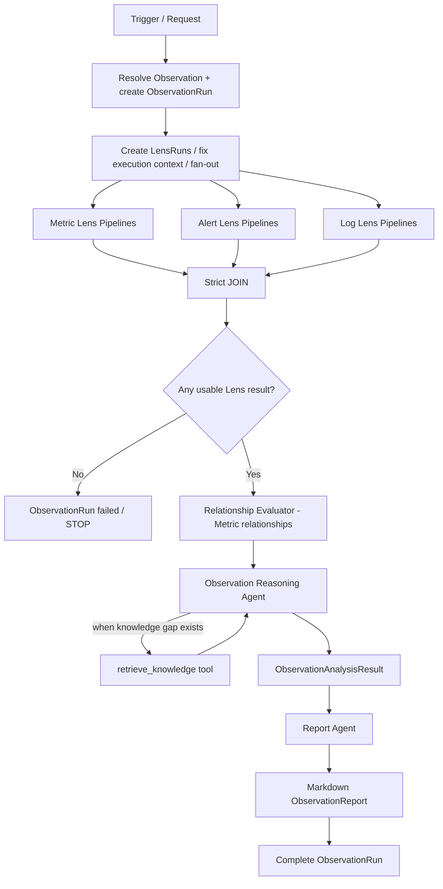
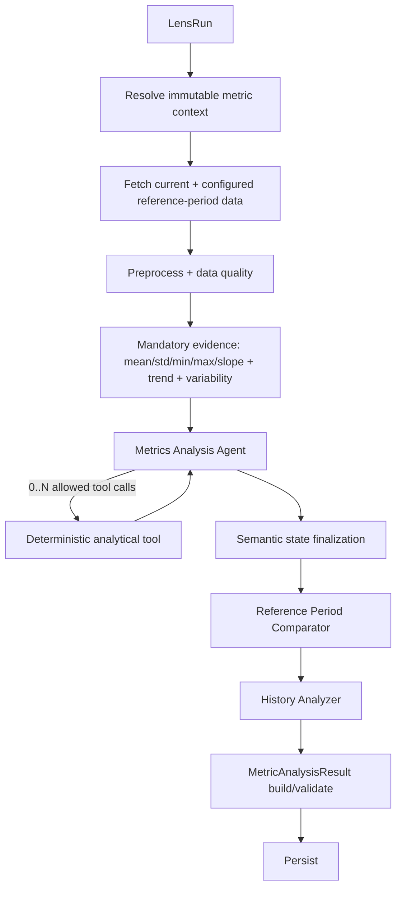
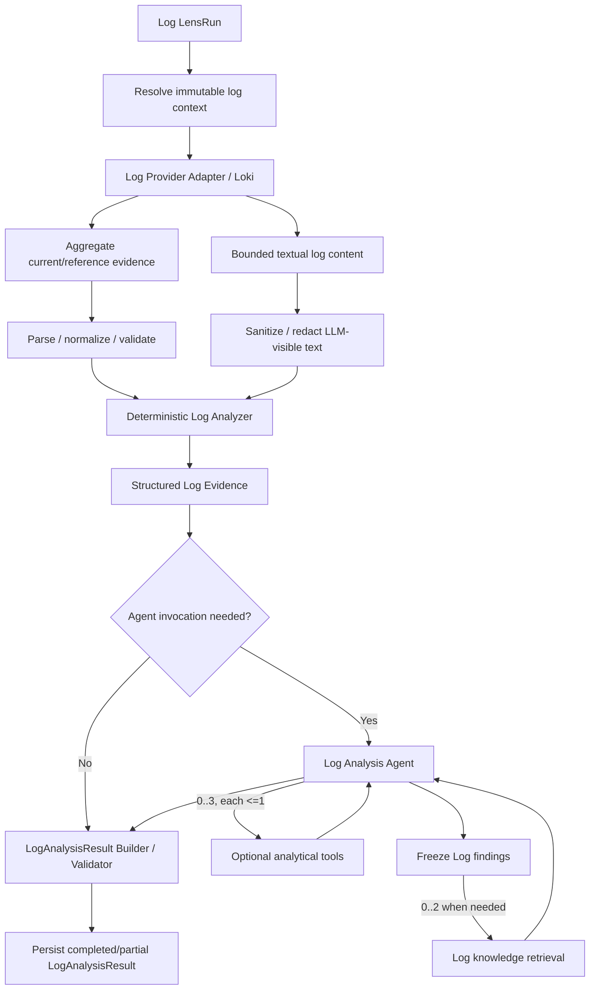

# Архитектурен документ: workflow, pipelines и agentic runtime

**Проект:** „Интелигентна мулти-агентна система за откриване на аномалии и супервизия на технологични процеси“  
**Статус:** Работна нормативна архитектурна референция за MVP  
**Версия:** 6.1
**Актуализирано:** 2026-09-09

## 1. Предназначение

Документът описва принципите на работа на Observation workflow-а, специализираните Lens pipelines, deterministic и agentic компонентите, междинните артефакти и границите на отговорност. MVP използва plain Python/`asyncio` orchestration и ADR-169 OpenRouter/PydanticAI production agent composition. Multi-process worker ownership, конкретният real KnowledgeRetriever stack и останалите изрично Open infrastructure decisions остават извън текущото решение.

## 2. Основна архитектурна теза

Системата използва **детерминистично оркестриран йерархичен workflow с bounded agentic sub-processes**.

```text
Deterministic workflow orchestration
        ↓
structured evidence acquisition
        ↓
bounded agentic analysis where useful
        ↓
deterministic semanticization / validation
        ↓
cross-Metric deterministic relationship evaluation
        ↓
agentic Observation reasoning
        ↕ optional bounded knowledge retrieval
        ↓
structured ObservationAnalysisResult
        ↓
separate Markdown report generation
```

Ключов принцип:

> **Pipeline-ът гарантира lifecycle correctness и mandatory completeness; агентът добавя адаптивност само в ясно ограничена reasoning boundary.**

## 3. Control plane и reasoning plane

### 3.1. Control plane — Observation Orchestrator

`Observation Orchestrator` е deterministic component, не LLM agent. Той:

- resolve-ва predefined/ad-hoc Observation;
- създава `ObservationRun` и `LensRun`-ове;
- фиксира execution scope/time context преди fan-out;
- dispatch-ва specialized Lens pipelines;
- налага maximum concurrency policy;
- чака strict JOIN;
- проверява дали има поне един usable Lens result;
- стартира Relationship Evaluation;
- стартира Observation Reasoning;
- стартира Report Generation;
- управлява terminal lifecycle на ObservationRun.

Той **не** анализира данни, не resolve-ва relationship participant semantic fields, не използва RAG, не формулира findings/hypotheses и не генерира narrative report.

On-demand public launch се адаптира към същия Orchestrator чрез single-process managed
`asyncio` host (ADR-168). Host-ът връща run identity само след durable initialization,
продължава workflow-а exactly once, и не въвежда втори execution model. Multi-process
task ownership, scheduling и event-driven triggering не са част от този MVP boundary.

### 3.2. Reasoning plane

Agentic reasoning се използва само в специализирани boundaries:

- `Metrics Analysis Agent` — adaptive optional analytical tool selection в immutable Metric Lens scope;
- `Log Analysis Agent` — Lens-local log interpretation + bounded optional analytical tools + bounded knowledge retrieval за вече наблюдавани log findings/templates;
- `Observation Reasoning Agent` — system-level synthesis + bounded on-demand knowledge retrieval;
- `Report Agent` — presentation-only преобразуване на structured analysis в Markdown.

## 4. Йерархичен workflow модел

```text
Observation Workflow
├── Preparation / resolve execution context
├── Lens Analysis fan-out
│   ├── Metrics Analysis Pipeline(s)
│   ├── Alerts Analysis Pipeline(s)      [MVP design Accepted]
│   └── Logs Analysis Pipeline(s)        [MVP design Accepted]
├── Strict JOIN
├── Usable-results gate
├── Relationship Evaluation             [Metric Lens participants only]
├── Observation Reasoning
│   └── bounded knowledge-retrieval tool loop when needed
├── Report Generation
└── Complete ObservationRun
```

Stage може да бъде deterministic function, service/tool, specialized agent, sub-pipeline, validator, persistence step, fan-out или JOIN. Pipeline не означава „верига само от агенти“.

## 5. High-level execution



## 6. Lens execution semantics

### 6.1. Independence and concurrency

LensRuns в един ObservationRun са **логически независими**. Физическият parallelism е execution policy, не архитектурно изискване. Runtime поддържа configurable `max_parallel_lens_runs` с public-launch default `4`; per-Lens deadline default-ът е `300s`. И двете стойности са server-owned и client не може да ги override-ва (ADR-168). Свободен execution slot се използва веднага; няма изискване за batch-by-batch execution.

За едно Observation има най-много един `pending|running` ObservationRun. Нов on-demand
launch при active run се отхвърля без runtime residue. След terminal state нов launch
създава fresh ObservationRun/LensRun identities според ADR-164.

### 6.2. Strict JOIN

Следващият stage започва само когато **всички** LensRuns са terminal:

```text
completed | partial | failed
```

Не се използва правило „достатъчно резултати“. Timeout трябва да доведе съответния LensRun до terminal failure state.

`cancelled` също е terminal lifecycle status, но използва отделен abort path: вече
terminal LensRuns се запазват, незавършените LensRuns и ObservationRun се terminalize-ват
като `cancelled`, и post-JOIN stages не стартират (ADR-165).

### 6.3. Degraded continuation

```text
>= 1 usable LensAnalysisResult → continue
0 usable LensAnalysisResult    → ObservationRun failed / STOP
```

Failed/unavailable Lens не означава normal state или липса на събитие.

## 7. Common Lens Pipeline contract

Orchestrator-ът работи с абстракцията:

```text
execute(LensRun) -> LensAnalysisResult
```

Конкретно:

```text
MetricsAnalysisPipeline -> MetricAnalysisResult
AlertsAnalysisPipeline  -> AlertAnalysisResult
LogsAnalysisPipeline    -> LogAnalysisResult
```

Type-specific analytical payload е различен, но lifecycle metadata са общи. За `completed|partial` pipeline-ът произвежда usable LensAnalysisResult. Failed execution винаги оставя terminal `LensRun`; type-specific failed result artifact е type-specific policy. За Alerts и Logs MVP failed LensRun не създава съответно `AlertAnalysisResult` или `LogAnalysisResult`.

## 8. Metrics Analysis Pipeline

Metrics pipeline има deterministic lifecycle и винаги включва bounded `Metrics Analysis Agent`.



Agentът може да избира и последователно да използва allowed tools, но не може да променя metric, time window, source query или да добавя process variables. `analysis_objectives` описват intent, а не tool whitelist.

## 9. Alerts Analysis Pipeline

Alerts pipeline има deterministic lifecycle с bounded agentic interpretation, но не копира Metrics pipeline механично.

```mermaid
flowchart TD
    LR[Alert LensRun] --> PA[Alert Provider Adapter]
    PA --> C[Mandatory current fetch]
    C --> N[Mandatory normalize + validate]
    N --> R[Mandatory reference fetch]
    R --> D[Deterministic Alert Analyzer]
    D --> MT[Mandatory analytical tools / capabilities]
    MT --> D
    D --> Z{record_count = 0?}
    Z -->|Yes| S[Skip Alert Analysis Agent
findings=[]
overall_importance=none]
    Z -->|No| A[Alert Analysis Agent]
    A -->|0..10 optional calls| OT[Allowed optional alert analytical tool]
    OT --> A
    A --> AO[findings + overall_importance]
    S --> B[AlertAnalysisResult Builder / Validator]
    AO --> B
    B --> P[Persist AlertAnalysisResult]
```

Core boundaries:

- provider selector определя alert scope; LensRun определя time scope;
- alert membership = lifecycle overlap с current/reference window;
- pipeline-ът гарантира mandatory fetch/normalize/reference/analysis lifecycle и не оставя задължителните операции на LLM избор;
- `Deterministic Alert Analyzer` остава отделен component и координира mandatory analytical tools/capabilities за activity, status distribution, durations, provider importance distribution и occurrence comparisons;
- `Alert Analysis Agent` е Lens-local и може да използва 0..10 allowed optional analytical tool calls върху вече наличното evidence/data; същият tool може да се използва многократно;
- optional tools не могат да fetch-ват нови alert-и, да променят selector/window/reference configuration или да разширяват Observation scope;
- optional tool `failed|timeout` не променя LensRun status; agentът продължава с наличното evidence;
- Alert Agent няма RAG и няма cross-lens/system diagnosis;
- zero-record path (`record_count=0`) пропуска agent-а;
- Builder/Validator държи final contract; persistence е отделна stage;
- failed Alert LensRun не създава/не persist-ва `AlertAnalysisResult`.

Detailed normative design: `13_alert_lens_and_analysis_concept.md`, `14_alerts_analysis_pipeline_detailed.md`, `15_alert_analysis_result_contract.md`.

## 10. Logs Analysis Pipeline

Logs pipeline използва deterministic lifecycle с bounded Lens-local agent, но не копира механично Alerts semantics.



Core boundaries:

- selector определя `which logs`, LensRun определя `when`; log membership е point-event timestamp membership;
- provider acquisition разделя aggregate evidence от bounded textual content и не предполага full-corpus materialization;
- parsing/level mapping е deterministic/configured; LLM не infer-ва log level от свободен текст;
- bounded LLM-visible log/template text минава през sanitization/redaction boundary и се третира като untrusted data;
- mandatory current evidence включва log activity/rate, level distribution и error-level activity;
- template extraction и configured reference comparisons са supplementary deterministic analyses;
- Log Agent може да използва максимум 3 optional analytical tools, по един call на tool, без data-scope expansion;
- Log Agent първо формира и freeze-ва observational findings; след това може да използва максимум 2 knowledge-retrieval calls за конкретни вече наблюдавани templates/error codes/messages;
- RAG-derived `knowledge_annotations` са отделен knowledge layer и не могат да създават/променят Log findings;
- Observation Reasoning не може да използва upstream Log `knowledge_annotations` като evidence за Observation findings; може да използва техните original knowledge refs за hypotheses;
- Log Agent failure води до `partial`, когато current deterministic core е usable;
- failed Log LensRun не създава/не persist-ва `LogAnalysisResult`.

Detailed normative design: `21_log_lens_and_analysis_concept.md` до `28_log_analytical_tools_and_knowledge_retrieval.md`.

## 11. Relationship Evaluation

Relationship Evaluation е deterministic stage след JOIN и преди Observation Reasoning.

```text
Input:  Relationship[] + LensAnalysisResult[]
Output: RelationshipEvaluation[]
```

Evaluator-ът сам resolve-ва participant results и използва само explicit `current_state` vocabulary. За MVP Relationships са **само между Metric Lens-ове**. Alert/Log evidence се корелира от Reasoning Agent, не от rule evaluator-а.

Applicability:

```text
applicable | not_applicable | unknown
```

Само при `applicable`:

```text
consistent | inconsistent | uncertain
```

## 12. Observation Reasoning Agent

### 12.1. Вход

Агентът не получава raw telemetry или пълна infrastructure/configuration структура. Входът е purpose-built:

```text
ObservationReasoningContext
  - compact semantic Observation identity/description/objective
  - compact Lens semantic metadata

usable_lens_results[]
  - completed
  - partial + short structured partial_reason

relationship_evaluations[]
  - self-contained semantic identity + evaluation evidence

unavailable_lenses[]
  - lens_id/type + short structured reason
```

`usable_lens_results` съдържат **пълните структурирани analytical results**, включително current/reference/history evidence, но не raw numerical/log streams. Type-specific knowledge enrichment като Log `knowledge_annotations` остава отделно маркирано вътре в result-а и не се третира като observational evidence.

### 12.2. Reasoning sequence

Агентът първо формира `findings` **само от Observation evidence**. Findings се считат frozen преди RAG и retrieval не може да ги създава или променя.
При Log results agentът трябва да различава:

```text
Log findings / deterministic evidence -> observational evidence
Log knowledge_annotations            -> external knowledge enrichment
```

Upstream `knowledge_annotations` не могат да създават или променят Observation findings. Те могат да бъдат използвани при hypothesis formation като already-retrieved knowledge, ако original `knowledge_refs` се запазват.


След това агентът решава дали конкретен finding изисква domain knowledge за обяснителна хипотеза. RAG е **tool capability в същия агент**, не отделен агент.

### 12.3. Bounded knowledge retrieval

За MVP:

```text
max retrieval calls = 2 (fixed system value)
```

Първият query трябва да произлиза от конкретни findings. Ако резултатът не е достатъчен, вторият query може да използва original findings + полезното от Retrieval #1 + оставащия knowledge gap. Агентът може да спре след 0 или 1 retrieval call.

Domain hypotheses се генерират само ако са едновременно:

```text
supported_by -> one or more findings
knowledge_refs -> retrieved domain knowledge actually used
```

При липса на достатъчно knowledge е валидно `hypotheses: []`.

### 12.4. ObservationAnalysisResult

Reasoning Agent произвежда structured machine-readable result с минимални полета:

```text
identity
overall_state
findings[]
hypotheses[]
limitations[]
```

Не се включват MVP полета за severity, confidence, recommendations, probability, root_cause, finding taxonomy или hypothesis ranking.

## 13. Report Agent

Report Agent е **presentation-only agent**.

Input:

```text
ObservationAnalysisResult
+ minimal Observation semantic context
```

Не получава LensAnalysisResult[], Relationship definitions, raw evidence, telemetry или RAG tool. Не прави нов analysis, не добавя findings/hypotheses, не променя overall_state и не генерира recommendations.

Output за MVP е Markdown presentation artifact с минимален metadata envelope.

## 14. Structured artifacts вместо conversational chain

Предпочитаната комуникация е:

```text
Stage A -> versioned structured artifact -> Stage B
```

а не free-text agent-to-agent conversation. Това поддържа validation, unit/integration testing, persistence, replay, tracing и framework independence.

## 15. Failure and uncertainty principles

- optional Metric analyzer failure -> `partial`, ако mandatory core е usable;
- unavailable Alert reference period -> `partial`, ако current mandatory alert analysis остава usable;
- failed current Alert query/deterministic analyzer/required Alert Agent -> failed Alert LensRun и без `AlertAnalysisResult`;
- failed Log Agent -> `partial`, когато current deterministic Log core е usable;
- failed Log current acquisition/minimal core -> failed Log LensRun и без `LogAnalysisResult`;
- Log optional tool/knowledge-retrieval failure -> non-fatal best-effort failure;
- `partial` остава usable;
- failed Lens -> unavailable evidence, не normal state;
- all Lens unusable -> Observation failed / STOP;
- top-level cancellation -> preserve terminal LensRuns, cancel unfinished LensRuns and ObservationRun, then STOP;
- Relationship missing condition evidence -> `applicability=unknown`;
- applicable Relationship с missing expected evidence -> `state=uncertain`;
- Reasoning може да върне `overall_state=uncertain` дори при един или повече валидни findings;
- липса на RAG-grounded explanation не обезсилва валиден finding.

## 16. Persistence boundary

Архитектурно се очаква да могат да се съхраняват поне:

```text
Observation / Lens / Relationship definitions
ObservationRun / LensRun
LensAnalysisResult(s)
RelationshipEvaluation(s)
ObservationAnalysisResult
ObservationReport
```

Конкретният database schema/technology остава Open.

За Alerts type-specific persistence policy е:

```text
completed/partial -> persist AlertAnalysisResult
failed            -> persist LensRun failure metadata/logs; no AlertAnalysisResult

Log-specific:
completed/partial -> persist LogAnalysisResult
failed            -> persist LensRun failure metadata/logs; no LogAnalysisResult
```

## 17. Нормативно резюме

1. Orchestrator-ът е deterministic control-plane component.
2. Workflow-ът е йерархичен, не проста agent chain.
3. LensRuns са independent; parallelism е configurable execution policy.
4. JOIN е strict и чака всички terminal LensRuns.
5. Lens pipelines имат common execution interface.
6. Metrics pipeline гарантира mandatory evidence и ограничава Metrics Agent до immutable scope.
7. Alerts pipeline използва provider-native scope + LensRun time semantics, guaranteed mandatory deterministic tool chain, separate Deterministic Alert Analyzer, bounded optional tool loop в Alert Analysis Agent, zero-record fast path и deterministic Result Builder.
8. Failed Alert LensRun не създава type-specific analytical result; usable AlertAnalysisResult съществува само при completed/partial.
9. Logs pipeline разделя aggregate evidence от bounded textual content и не изисква full-corpus materialization.
10. Log Agent има bounded optional analytical tools и bounded RAG след freeze на findings; retrieved knowledge се пази отделно от observational findings.
11. Failed Log LensRun не създава LogAnalysisResult; Log Agent failure може да остави usable partial result.
12. Relationships са engineer-defined, deterministic и metric-only за MVP.
13. Observation Reasoning работи върху full structured results + compact semantic config, не raw telemetry.
14. Observation findings са evidence-grounded и не могат да използват upstream Lens-local knowledge annotations като observational evidence.
15. Observation-level direct RAG е on-demand tool в bounded loop, fixed max 2 calls; upstream Log knowledge refs могат да се reuse-нат за hypotheses.
16. Hypotheses са 0..N, knowledge-grounded, unranked и traceable към findings + knowledge refs.
17. ObservationAnalysisResult е малък structured contract без confidence/recommendations/severity.
18. Report Agent е separate presentation layer и изкарва Markdown.
